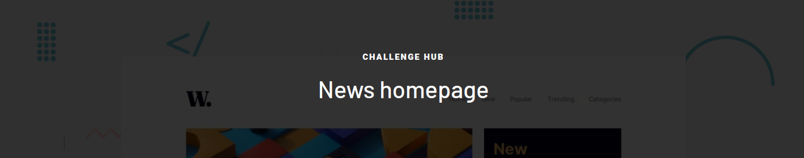

# Frontend Mentor - News homepage 

### Challenge HTML e CSS [Frontend Mentor](https://www.frontendmentor.io) 
 
Esse challenge consiste em criar uma página inicial de noticias procurando ficar o mais semelhante possivel do design. 
 
O website deve ser: 
 
- Responsivo  
- Possuir interações de hover e focus como no design  
- <strong> Bonus </strong> : Um menu com toggle.
 

### Links

- Solução URL: [Add solution URL here](https://your-solution-url.com)
- Live Site URL: [Add live site URL here](https://your-live-site-url.com)